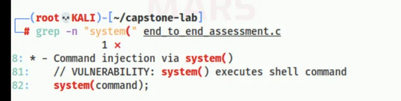
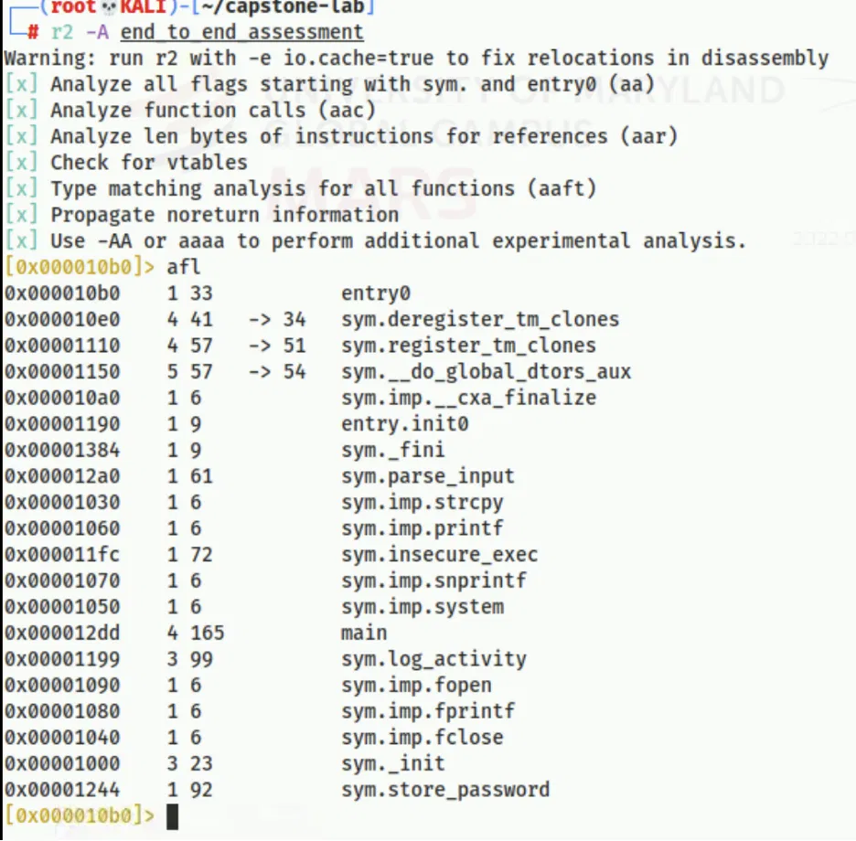
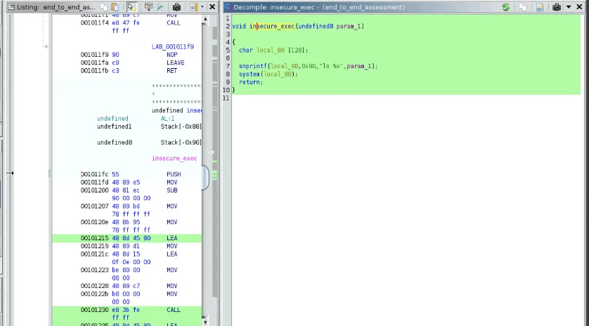
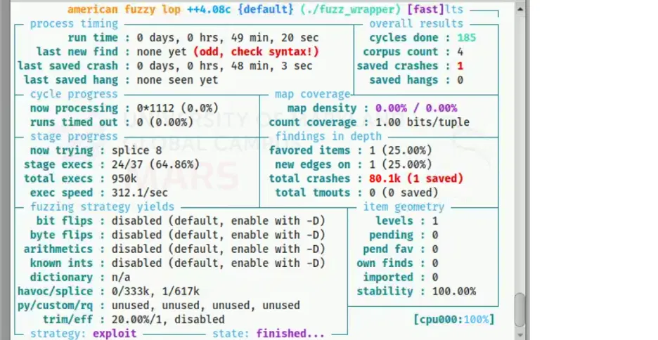

# Binary Security Assessment — Static Analysis, Reverse Engineering & Fuzzing

A full security assessment of a vulnerable 64-bit Linux binary, carried out end to end: from first-pass string triage, through source and binary static analysis, reverse engineering, and automated fuzzing, to a documented set of findings with severity ratings and remediation guidance.

**Tools:** `strings` · `radare2` · `Ghidra` · `AFL++` · `GDB` · Kali Linux
**Focus:** application security · reverse engineering · vulnerability analysis · OWASP / CWE mapping

> Completed as part of my M.S. in Cyber Operations (CY645 – Software Exploitation and Resiliency). The target was an intentionally vulnerable lab binary provided for analysis; all testing was done in an isolated VM.

---

## Overview

I was given a compiled binary (`end_to_end_assessment`) with no source documentation and asked to determine whether it was safe to deploy. Working through it in phases, I confirmed **three serious vulnerabilities** — and, importantly, no single tool surfaced all three. Each phase produced evidence the others couldn't, which is the whole point of a layered assessment.

My conclusion: **the binary should not be deployed in any environment with sensitive data, network exposure, or untrusted input.**

---

## Target

| Property | Value |
| --- | --- |
| File type | ELF 64-bit LSB PIE executable |
| Architecture | x86-64, dynamically linked |
| Symbols | Not stripped (debug symbols present) |
| Compiler | GCC (Debian 12.2.0) |
| Protections | NX disabled, no stack canaries |

I generated and recorded MD5/SHA-256 hashes up front so every later finding could be tied back to the exact artifact analyzed.

---

## Approach

1. **String triage** — ran `strings` to get a fast read on the binary. Format strings like `ls %s`, a `secrets.txt` reference, `USER=%s PASS=%s`, and an imported `strcpy` immediately pointed to three likely weakness classes.
2. **Static / source analysis** — classified the suspected issues and mapped them to the OWASP Top 10 and CWE.
3. **Reverse engineering with radare2** — disassembled the unstripped functions to confirm each issue at the binary level and located the exact call sites.
4. **Decompilation with Ghidra** — used the decompiled view to read the logic in near-C form and validate the radare2 findings.
5. **Fuzzing with AFL++** — drove the binary with mutated input to prove exploitability rather than just assert it.
6. **Crash analysis with GDB** — inspected the crashing state to characterize the overflow.

---

## Findings

| # | Vulnerability | OWASP 2025 | CWE | Severity |
| --- | --- | --- | --- | --- |
| 1 | OS Command Injection | A03: Injection | CWE-78 | Critical |
| 2 | Stack-Based Buffer Overflow | A04: Insecure Design | CWE-120 | Critical |
| 3 | Plaintext Credential Storage | A07: Auth Failures | CWE-256 / CWE-798 | High |

### 1. OS Command Injection — Critical

`insecure_exec()` builds a shell command with `snprintf` using the format `ls %s` and passes it straight to `system()`. radare2 disassembly confirmed the `snprintf` → `system` path, and cross-referencing (`axt`) showed `system()` is reached **only** from this one function — so user-controlled input flows directly into a shell. Demonstrated with a simple input.

### 2. Stack-Based Buffer Overflow — Critical

`parse_input()` calls `strcpy(buffer, input)` into a 256-byte stack buffer with no length check. AFL++ generated crashing inputs reliably (inputs of ~268 bytes — 12+ bytes past the buffer — produced consistent `SIGSEGV`s). GDB showed the saved frame pointer and return address overwritten with input bytes, confirming a classic stack-smashing overflow with full control-flow corruption — exploitable for arbitrary code execution given the binary's disabled NX protection.

### 3. Plaintext Credential Storage — High

`store_password()` opens `secrets.txt` in append mode and writes `USER=%s PASS=%s` in cleartext, with default `0644` permissions (world-readable). Confirmed both in strings and at the binary level via the `fopen` → `fprintf` sequence.

---

## Remediation

- **Command injection** — remove the `system()` call; if directory listing is needed, use `opendir()` / `readdir()` instead of shelling out.
- **Buffer overflow** — replace `strcpy()` with `strncpy()` and validate input length against the buffer size before copying.
- **Credential storage** — stop writing plaintext credentials; use a strong password hash (bcrypt, scrypt, or Argon2) or a dedicated secrets manager, and tighten file permissions.
- **Build hardening** — recompile with `-fstack-protector-strong`, `-D_FORTIFY_SOURCE=2`, and `-Wl,-z,relro,-z,now,-z,noexecstack` to restore baseline binary protections.

---

## Key Takeaways

- **Layered analysis is essential to see the full picture of an assessment.** Static analysis showed the patterns, reverse engineering confirmed them at the binary level, and fuzzing proved the overflow was actually reachable. No single technique would have given the full picture.
- **Symbols and missing protections are force multipliers for an attacker.** An unstripped binary with NX off made the overflow path far easier to trace and weaponize — a concrete argument for build-time hardening.
- **Tie findings to standards.** Mapping each issue to OWASP and CWE turns "this looks bad" into something a team can prioritize and track.

---

## Screenshots

**Static analysis — command injection via `system()`**

**Reverse engineering — function map in radare2**

**Decompilation — `insecure_exec()` in Ghidra**

**Fuzzing — AFL++ producing 80.1k crashes**

